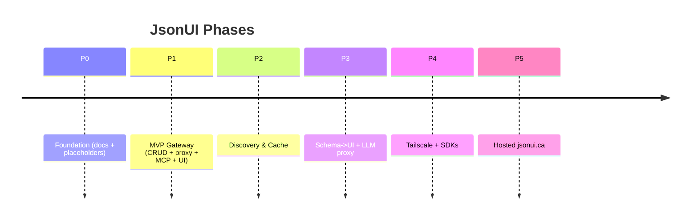

# Architecture

## Open Questions
1. **Blazor hosting**: Should the UI be hosted inside the same ASP.NET Core process as the gateway (simpler) or as a separate SPA that talks to the admin API? (Assumption: host inside the gateway for v1.)
2. **Redis optional**: Should JsonUI treat Redis as optional and degrade gracefully if disabled? (Assumption: yes; caching features require Redis, but JsonUI runs without it.)

## System Overview
JsonUI is a single Docker-deployable runtime that:
- exposes upstream APIs as MCP tools;
- provides an admin API + Blazor UI to manage integrations/actions/secrets/keys;
- executes proxy actions with SSRF guardrails, secret injection, rate limiting, and caching;
- optionally discovers local services via Docker/CasaOS;
- optionally proxies LLM providers with policy enforcement;
- optionally integrates with Tailscale for secure remote access.

## Architecture Diagram
```mermaid
flowchart TB
  subgraph Clients
    MCPClient[MCP Clients\n(Claude/ChatGPT/Desktop)]
    Browser[Admin UI\n(Blazor)]
    Devs[Developers\nSDK/CLI]
  end

  subgraph JsonUI[JsonUI Runtime]
    Edge[HTTP Edge Router]
    Auth[API Key Auth\nScopes + Rate Limits]
    MCP[MCP Server\nList/Call Tools]
    Admin[Admin API\nCRUD + Test + Audit]
    UI[Blazor UI\nAdmin Console]

    Registry[Tool Registry\nIntegrations + Actions]
    Schema[Schema Layer\n(JSON Schema + hints)]
    Proxy[Proxy Engine\nTemplate -> HTTP]
    Guard[SSRF Guard]
    Cache[Cache Layer\nOpt-in GET caching]
    Secrets[Secrets Vault\nEncrypted]
    Audit[Audit + Logs\nRedaction]
    Discover[Discovery\nDocker + CasaOS]
    LLMProxy[LLM Proxy\nPolicy + Pass-through]
    Tail[Tailscale Adapter\nOptional]
  end

  subgraph Storage
    DB[(SQLite)]
    Redis[(Redis)]
  end

  subgraph Upstreams
    Local[Local Services\n(Sonarr, n8n, ntfy, etc.)]
    Public[Public APIs\n(TMDB/TVDB/etc.)]
    LLMs[LLM Providers\n(OpenAI/etc.)]
    TSNet[Tailscale Network]
  end

  MCPClient -->|MCP HTTP| Edge
  Browser --> Edge
  Devs --> Edge

  Edge --> Auth
  Auth --> MCP
  Auth --> Admin
  UI --> Admin

  Admin --> Registry
  Registry --> DB
  Secrets --> DB
  Audit --> DB

  Registry --> Schema
  Schema --> UI

  MCP --> Registry
  MCP --> Proxy

  Proxy --> Guard
  Proxy --> Cache
  Cache --> Redis
  Proxy --> Secrets
  Proxy --> Local
  Proxy --> Public

  Discover --> Registry

  LLMProxy --> LLMs

  Tail --- Edge
  Tail --- TSNet
```

## Phased Roadmap Diagram


## Dependency Direction
- `JsonUi.Core`: domain + interfaces only.
- `JsonUi.Infrastructure`: implementations (EF Core, Redis, encryption, discovery) depending on Core.
- `JsonUi.Gateway`: ASP.NET Core host depending on Core + Infrastructure.
- `JsonUi.Ui`: Blazor admin UI depending on Gateway (via Admin API/assembly) while keeping business logic in Core.

## Data Stores
- SQLite: configuration, secrets (encrypted), api keys, audit events.
- Redis (optional): cache entries keyed by integration/action + URL + caller scope.

## Optional Tailscale
JsonUI can integrate with Tailscale via sidecar container or documented setup so remote MCP clients can reach local JsonUI without exposing it publicly.
